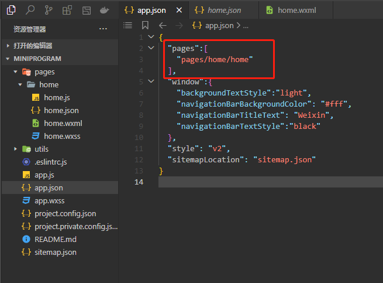
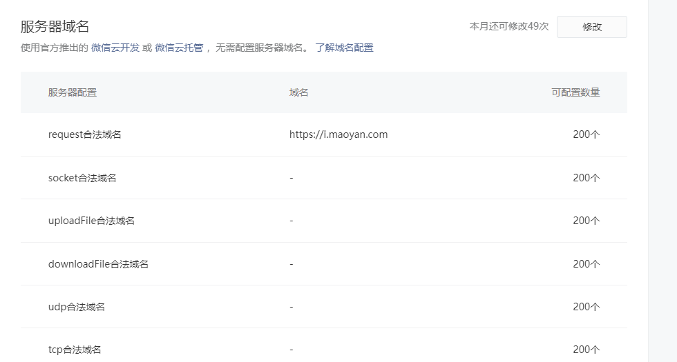
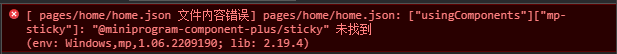

# 小程序开发

## 一、小程序开发流程

### 1.[微信公众平台后台](https://mp.weixin.qq.com/)注册并登录生成 AppID

### 2.下载[微信开发者工具](https://developers.weixin.qq.com/miniprogram/dev/devtools/download.html)

### 3.新建一个空文件夹，使用微信开发者工具新建一个小程序项目，使用生成的 AppID。这里只有管理员才可以上传代码，但是可以在[成员管理](https://mp.weixin.qq.com/wxamp/user/manage?action=index&use_role=1&token=311186451&lang=zh_CN)里添加项目开发人员

### 4.开发者可以使用微信开发者工具在真机上预览自己的小项目

## 二、项目结构

### 1.小程序所有的页面都是在 pages 文件夹下，app.json 是全局配置文件，在 app.json 的 pages 数组里直接写入路径，会自动在 pages 文件夹下生成每个页面对应的文件夹，每个子目录下有 js/json/wxml/wxss 四个文件



### 2.[sitemap.json](https://developers.weixin.qq.com/miniprogram/dev/reference/configuration/sitemap.html) 文件：用于配置小程序及其页面是否允许被微信索引(爬虫)

## 三、全局配置

### 1.在 app.json 中全局配置

### 2.window 的配置：导航栏，下拉刷新，loading 样式

### 3.[底部 tabBar 的配置](https://developers.weixin.qq.com/miniprogram/dev/reference/configuration/app.html#tabBar)：lists，borderStyle，selectedColor，color，backgroundColor)

### 4.每个页面的 json 文件可重新配置 app.json 中 window 的属性，达到覆盖的作用

```json
"tabBar": {
  "list": [{
    "pagePath": "pages/home/home",
    "text": "首页",
    "iconPath": "./assets/images/home.png",
    "selectedIconPath": "./assets/images/home_selected.png"
  }, {
    "pagePath": "pages/logs/logs",
    "text": "日志",
    "iconPath": "./assets/images/test.png",
    "selectedIconPath": "./assets/images/test_selected.png"
  }],
  "borderStyle": "white"
},
```

## 四、数据绑定：双大括号

```html
<!-- 表达式 -->
<view>{{ 20 + 10 }}</view>
<!-- 三元表达式 -->
<view>{{ 20 > 10 ? 'aaa' : 'bbb' }}</view>
<!-- 变量 -->
<view>{{ value }}</view>
<!-- 属性同样支持变量 -->
<view class="my-{{ class[0] }}">aaa</view>
<view class="my-{{ class[1] }}">bbb</view>
<view class="my-{{ class[2] }}">ccc</view>
<!-- 列表渲染，默认item与index名 -->
<view wx:for="{{list}}" wx:key="index">
  {{index}}：{{item.name}}-{{item.age}}
</view>
<!-- 列表渲染，改变item与index名 -->
<view wx:for="{{list}}" wx:for-index="idx" wx:for-item="ele" wx:key="idx">
  {{idx}}：{{ele.name}}-{{ele.age}}
</view>
<!-- 条件渲染 -->
<!-- wx:if其实就是visibility:visible/hidden，元素会有局部渲染的过程，适用于运行条件不大可能改变的场景 -->
<view wx:if="{{isCreated}}"> 我是动态创建和删除的-if </view>
<view wx:else="{{isCreated}}"> 我是动态创建和删除的-else </view>
<!-- 也可用三元表达式表示 -->
<view class="{{isCreated ? 'show' :'hidden'}}"> 我是动态创建和删除的 </view>
<!-- hidden其实就是display:block/none，dom元素在，一开始就被渲染了，适用于频繁切换的场景 -->
<view hidden="{{isShow}}"> 我是动态隐藏和显示的 </view>
```

```json
 data: {
        value: '测试数据',
        class: ['aaa', 'bbb', 'ccc'],
        list: [{
            name: 'qiu1',
            age: 1,
        }, {
            name: 'qiu2',
            age: 18,
        }, {
            name: 'qiu3',
            age: 182,
        }, {
            name: 'qiu4',
            age: 183,
        }],
        isCreated: true,
        isShow: true,
    }
```

## 五、事件绑定，获取视图状态，改变视图状态

### 1.获取 data：this.data

### 2.改变 data：this.setData({})

### 3.给事件传参：给元素绑定 data-xxx，获取参数是 event.target.dataset.xxx

### 4.事件绑定事件只能用在事件上，不能用在双括号内，双括号内调用函数借助 wsx

```html
<!-- 事件绑定，bindtap会向上冒泡 -->
<button bindtap="handleBindTap" type="primary">点击1</button>
<!-- 事件绑定，catchtap不会向上冒泡 -->
<button catchtap="handleCatchTap" type="primary">点击2</button>
<!-- 尝试使用区别一下bindtap和catchtap -->
<!-- 点击inner view会触发handleInnerTap和handleCenterTap -->
<!-- 点击center view只触发handleCenterTap -->
<!-- 点击outer view只触发handleOuterTap -->
<view bindtap="handleOuterTap" class="outer">
  outer view
  <view catchtap="handleCenterTap" class="center">
    center view
    <view bindtap="handleInnerTap" class="inner">inner view</view>
  </view>
</view>
<!-- 点击事件传递参数 -->
<view wx:for="{{ list }}" wx:key="index">
  <text>{{ item }}</text>
  <!-- 在标签上用data-xx，点击事件可拿到值 -->
  <button class="delete" bindtap="handleDelete" data-id="{{ index }}">
    删除
  </button>
</view>
```

```js
// handleBindTap(){ } es6的写法
    handleBindTap() {
        console.log(this.data.value); // 获取data的数据
        // 改变data的数据，跟react的diff算法一样
        this.setData({
            value: 'cql',
        })
    },

    handleCatchTap() {
        this.setData({
            isCreated: !this.data.isCreated,
            isShow: !this.data.isShow
        })
    },

    handleInnerTap(event) {
        console.log('inner tap', event);
    },

    handleCenterTap(event) {
        console.log('center tap', event);
    },

    handleOuterTap(event) {
        console.log('outer tap', event);
    },

    handleDelete(e) {
        // 拿到标签上绑定的值
        const id = e.target.dataset.id;
        console.log(id);
    },
```

## 六、wxss 语法

### 跟 css 一样，部分不同：

### 1.尺寸单位：rpx---微信小程序独有解决屏幕自适应的尺寸单位，规定屏幕宽度为 750rpx，使用 rpx 设置元素和字体的大小，在不同尺寸自动适配。官方建议以 iphone6 设计稿为标准，1rpx = 0.5px = 1 物理像素。iphone6 量出来的尺寸是多少 px，最终就以多少 rpx 为准 [原因](https://blog.csdn.net/weixin_41829477/article/details/104265054)

### 2.样式导入

```bash
@import "common.wxss";
```

## 七、[wxs 语法](https://developers.weixin.qq.com/miniprogram/dev/reference/wxs/)：小程序的一套脚本语言

### 使用场景：当在 wxml 中，放在双大括号内的数据需要进行逻辑运算的时候，注意 wsx 里面不能使用 js 的 es6 语法

```html
<!-- 获取js状态的值，传给wxs模块计算格式化时间戳 -->
<wxs src="./utils.wxs" module="utils"></wxs>
<view>{{utils.handleDate(timestamp)}}</view>

<!-- 模糊查询 -->
<view>模糊查询</view>
<view>
  <input
    type="text"
    placeholder="请搜索"
    value="{{textValue}}"
    bindinput="handleInput"
    class="input"
  />
</view>
<view wx:for="{{utils.filterDataList(dataList,textValue)}}" wx:key="index">
  {{item}}
</view>
```

```js
// 5-wxs.js
data: {
    textValue: "",
    timestamp: 1667550940096,
    dataList: ["cherry", "alex", "chris", "niki", "jake", "eric", "annie"]
},
handleInput(event) {
    this.setData({
        textValue: event.detail.value
    });
},
// utils.wsx
// 把时间戳转换为年月日时分秒的格式
function handleDate(timestamp) {
    var year = getDate(timestamp).getFullYear();
    var month = getDate(timestamp).getMonth() + 1;
    var date = getDate(timestamp).getDate();
    var hour = getDate(timestamp).getHours();
    var minute = getDate(timestamp).getMinutes();
    var second = getDate(timestamp).getSeconds();
    return year + '-' + month + '-' + date + ' ' + hour + ':' + minute + ':' + second;
};

// 模糊查询
function filterDataList(data, value) {
    return data.filter(function (item) {
        return item.indexOf(value) > -1;
    });
}

module.exports = {
    handleDate: handleDate,
    filterDataList: filterDataList
};
```

## 八、[数据请求](https://developers.weixin.qq.com/miniprogram/dev/api/network/request/wx.request.html)

### 1.使用微信自带的 api：wx.request、wx.uploadFile、wx.downloadFile，只能请求 https 协议的，wx.connectSocket，只能请求 wss 协议的

### 2.微信小程序不是浏览器，是一个带有浏览器内核的 webview，因此不存在跨域限制，跨域是由于浏览器的同源策略导致的，协议，域名，端口不同，会导致跨域

### 3.不存在跨域，但是需要配置[服务安全域名](https://mp.weixin.qq.com/wxamp/devprofile/get_profile?token=1994225168&lang=zh_CN)，应用到小程序中




```js
wx.request({
  url: 'example.php', //仅为示例，并非真实的接口地址
  data: {
    x: '',
    y: '',
  },
  header: {
    'content-type': 'application/json', // 默认值
  },
  success: (res) => {
    // 使用箭头函数，让this与上下文一致，才可以使用this.setData
    this.setData({
      dataList: res.data.data.hot,
    });
  },
});
```

### 4.调用自己本地的接口，需要先打开不校验合法域名开关，才可以调通


## 九、[常用组件](https://developers.weixin.qq.com/miniprogram/dev/component/)

### 1、swiper

| 模式      | swiper 样式    | swiper image 样式        | 解释                                                                                           |
| --------- | -------------- | ------------------------ | ---------------------------------------------------------------------------------------------- |
| widthFix  | height:296rpx; | width:100%;              | 缩放模式，宽度不变，高度自动变化，保持原图宽高比不变 以 iphone6 为参考                         |
| aspectFit | height:200px;  | width:100%;height:200px; | 缩放模式，保持纵横比缩放图片，使图片的长边能完全显示出来。也就是说，可以完整地将图片显示出来。 |

```html
<swiper
  circular="{{true}}"
  indicator-dots="{{true}}"
  autoplay="{{true}}"
  interval="{{2000}}"
  duration="{{500}}"
>
  <swiper-item wx:for="{{swiperList}}" wx:key="index">
    <image src="{{item.image_url}}" mode="widthFix" class="image"></image>
  </swiper-item>
</swiper>
```

```css
image {
  width: 100%;
}

swiper {
  /* swiper默认高度150px，以iphone6为样式参考，适配所有机型的轮播图 */
  height: 300rpx;
}
```

### 2、scroll-view

```html
<view>纵向滚动</view>
<scroll-view
  class="box"
  scroll-y="{{true}}"
  style="height: 300rpx;"
  bindscrolltolower="handleLower"
  refresher-enabled="{{true}}"
  bindrefresherrefresh="handleRefresh"
  refresher-triggered="{{isRefresh}}"
>
  <view>1111</view>
  <view>2222</view>
  <view>3333</view>
</scroll-view>

<view>横向滚动</view>
<scroll-view
  class="box2"
  enable-flex="{{true}}"
  scroll-x="{{true}}"
  style="width: 600rpx;height:200rpx;display: flex;"
  bindscrolltolower="handleRight"
>
  <view>aaa</view>
  <view>bbb</view>
  <view>ccc</view>
  <view>ddd</view>
</scroll-view>
```

```css
.box view {
  height: 400rpx;
  background: pink;
  border: 1px solid #ccc;
}

.box2 view {
  width: 300rpx;
  height: 200rpx;
  background: pink;
  border: 1px solid #ccc;
  flex-shrink: 0;
}
```

```js
/**
 * 页面的初始数据
 */
data: {
    isRefresh: false,
    idx: 1,
},

handleLower() {
    console.log("到底了");
},

handleRefresh() {
    console.log("上拉刷新了");
    setTimeout(() => {
        this.setData({
            isRefresh: false
        });
    }, 2000);
},

handleRight() {
    console.log("滚动到右边了");
},
```

### 3、checkbox

## 十、[自定义组件](https://developers.weixin.qq.com/miniprogram/dev/framework/custom-component/)

### 1.封装自定义组件：在项目根目录新建 components 文件夹，内以每个组件名字命名文件夹，每个文件夹内还是跟 pages 一样的结构，在每个文件夹内新建 Component 选项，键入组件名（组件名一般首字母大写）不用后缀，会自动出现对应的 wxml、wxss、json、js 文件


### 2.在 pages 页面中引入自定义组件


### 3.父组件与子组件通信：引入子组件后，通过在子组件上传属性值。然后在子组件接收属性并使用

### 4.子组件与父组件通信，只能在父组件上定义 bindxxx 事件，子组件调用父组件的回调函数并传递参数给父组件。bindParentEvent 就是

```html
<!-- 父 -->
<navbar
  list="{{list}}"
  current="{{current}}"
  bindParentEvent="handleParent"
></navbar>
```

```js
// 父
data: {
    list: ['上衣','鞋子','裙子', '裤子'],
    swiperList: ['上衣的','鞋子的','裙子的', '裤子的'],
    current: 0,
},

// 父组件监听子组件传过来的值，event.detail是子组件传递的值
handleParent(event) {
    // console.log("监听到了子组件", event.detail);
    this.setData({
        current: event.detail
    });
},
```

```js
// 子
/**
 * 组件的属性列表，接收父组件的属性
 */
properties: {
    list: {
        type: Array,
        value: ["即将上映","已经上映"],
    },
    current: {
        type: Number,
        value: 0,
    }
},

/**
 * 组件的方法列表
 */
methods: {
    handleTap(event) {
        // 子组件与父组件通信：触发父组件定义的参数，回调传递给父组件
        this.triggerEvent("ParentEvent", event.target.dataset.index)
    }
}
```

```html
<!-- 子 -->
<view class="box">
  <view
    wx:for="{{list}}"
    wx:key="index"
    class="item {{current === index ? 'active': ''}}"
    bindtap="handleTap"
    data-index="{{index}}"
    >{{item}}</view
  >
</view>
```

### 5.slot：插槽。slot 作为组件的复用，同时可以避免一些通信问题，slot 在父组件中，可以访问父组件的 this。 当子组件开发好了，父组件引用的时候，想在子组件中传入 html 结构的代码，就要在子组件中预留 slot 的位置。默认支持一个插槽，如果想要多个插槽，slot 上添加 name 值，一一对应。

#### （1）使用单个插槽

```html
<!-- 子组件TopHeader -->
<text>topHeader</text>

<slot></slot>

<!-- 父组件 -->
<TopHeader>
  <view>我是一个插槽，插到子组件中的</view>
</TopHeader>
```

#### （2）使用多个插槽，需要开始多插槽机制，两个子组件通过 slot 通信

```html
<!-- 父 -->
<view class="title">点击返回按钮，让footer组件动态显隐</view>

<TopHeader>
  <!-- 插槽是直接定义在父组件上，所以可以访问到父组件的实例-this -->
  <button slot="before" bindtap="handleTap">返回</button>
  <button slot="after">首页</button>
</TopHeader>

<footer wx:if="{{isShow}}"></footer>
```

```js
// 父
data: {
    isShow: false,
},

handleTap() {
    this.setData({
        isShow: !this.data.isShow
    });
},
```

```html
<!-- topHeader子 -->
<view class="box">
  <slot name="before"></slot>
  <text>topHeader</text>
  <slot name="after"></slot>
</view>
<!-- footer子 -->
<view class="footer"></view>
```

```js
// topHeader子
options: {
    multipleSlots: true // 在组件定义时的选项中启用多 slot 支持
},
```

### 6、组件的生命周期，常用的有 attached 和 detached。attached 是在组件实例被挂载的时候执行，detached 是组件实例被卸载的时候执行。

```js
lifetimes: {
    attached: function(){
        // 在组件实例进入页面节点树时执行
    },
    detached: function() {
        // 在组件实例被从页面节点树移除时执行
    }
},
```

## 十一、页面级生命周期

```js
Page({
  /**
   * 生命周期函数--监听页面加载，请求ajax接口 ，只会执行一次
   */
  onLoad(options) {
    console.log('onLoad');
  },

  /**
   * 生命周期函数--监听页面初次渲染完成，只会执行一次
   */
  onReady() {
    console.log('onReady');
  },

  /**
   * 生命周期函数--监听页面显示，每次切换页面都会走
   */
  onShow() {
    console.log('onShow');
  },

  /**
   * 生命周期函数--监听页面隐藏，每次切换页面都会走
   */
  onHide() {
    console.log('onHide');
  },

  /**
   * 生命周期函数--监听页面卸载，只会执行一次
   */
  onUnload() {
    console.log('onUnload');
  },

  /**
   * 页面相关事件处理函数--监听用户下拉动作
   */
  onPullDownRefresh() {},

  /**
   * 页面上拉触底事件的处理函数
   */
  onReachBottom() {},

  /**
   * 用户点击右上角分享
   */
  onShareAppMessage() {},
});
```

## 十二、[扩展组件](https://developers.weixin.qq.com/miniprogram/dev/platform-capabilities/en/extended/component-plus/)使用

### 需要 npm init 先初始化生成 package.json 文件，然后 npm 安装组件，引入组件，然后遇到报错，因为没有构建 npm，点一下构建就好了。需要注意的是每次 npm install 一个组件都需要构建一次。

```bash
npm init
npm install @miniprogram-component-plus/sticky
// page.json
{
    "usingComponents": {
        "mp-sticky": "@miniprogram-component-plus/sticky"
    }
}
```




## 十三、页面跳转

| 方法            | 解释                                                               |
| --------------- | ------------------------------------------------------------------ |
| wx.navigateTo   | 保留当前页面，跳转到应用内的某个页面。但是不能跳到 tabbar 页面     |
| wx.redirectTo   | 关闭当前页面，跳转到应用内的某个页面。但是不允许跳转到 tabbar 页面 |
| wx.switchTab    | 跳转到 tabBar 页面，并关闭其他所有非 tabBar 页面                   |
| wx.navigateBack | 回退几级                                                           |

```js
// home.js
handleDetail(e) {
  const id = e.currentTarget.dataset.id;
  const title = e.currentTarget.dataset.title;
  wx.navigateTo({
    url: `/pages/detail/detail?id=${id}&title=${title}`,
  });
}
// detail.js
onLoad(options) {
  // options是接收跳转的参数
  console.log(options);
  // 动态设置小程序标题
  wx.setNavigationBarTitle({
    title: options.title,
  })
},
```

## 十四、从列表页进入详情页，有时候为了方便调试详情页，不想每次重新编译都要从列表页重新点进去，可以进入详情页后选择添加编译模式，方便开发。


## 十五、一些常用的 api

| api                      | 说明                   |
| ------------------------ | ---------------------- |
| wx.previewImage          | 在新页面中全屏预览图片 |
| wx.showLoading           | 显示 loading           |
| wx.hideLoading           | 隐藏 loading           |
| wx.stopPullDownRefresh   | 停止下拉               |
| wx.setNavigationBarTitle | 动态设置当前页面的标题 |
| wx.showToast             | 显示提示信息           |
| wx.showModal             | 显示模态框             |
| wx.getUserProfile        | 获取微信授权           |
| wx.setStorageSync        | 存储信息至本地存储     |
| wx.getStorageSync        | 获取本地存储信息       |

## 十六、引入 weui 组件库

### 1、[在 app.json 文件中引入 weui 组件库](https://developers.weixin.qq.com/miniprogram/dev/reference/configuration/app.html#useExtendedLib)

```json
"useExtendedLib": {
    "weui": true
}
```

### 2、在每个页面的 json 文件中按需引入相应的组件，在 wxml 使用

```json
{
  "usingComponents": {
    "mp-searchbar": "weui-miniprogram/searchbar/searchbar"
  },
  "navigationBarTitleText": "搜索"
}
```
